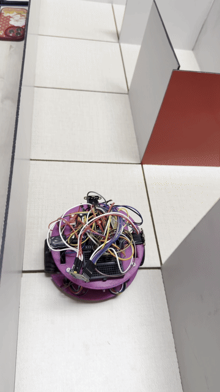

# Toots — Autonomous Micromouse Robot

An autonomous maze-solving robot built on an ESP32, using a floodfill algorithm, PID-corrected motor control, and time-of-flight wall sensing to navigate an 8×8 maze without human input.

**Team:** Razan Shalabi, Shatha Abualrub, Lara Daifallah, Ghada Swalha
**Instructor:** Wasel Ghanem
**Institution:** Birzeit University



*Toots completing a speed-run pass after the exploration phase.*

## Overview

Toots explores an 8×8 maze, builds a map of its walls, and computes the shortest path to the center. It then executes that path at higher speed on a return run. Core capabilities:

- Real-time wall detection using three VL53L0X time-of-flight sensors
- Wheel odometry via interrupt-driven magnetic encoders
- Shortest-path planning with a floodfill (BFS) solver
- PID-corrected differential drive to maintain heading between walls
- A web dashboard, served directly from the ESP32, for live monitoring and parameter tuning

## Documentation

| Resource | Description |
|---|---|
| [`hardware/README.md`](hardware/README.md) | Full parts list, pin map, and per-component wiring notes |
| [`hardware/3d-models/`](hardware/3d-models/README.md) | Chassis STL file and Fusion 360 source |
| [`software/README.md`](software/README.md) | Firmware architecture, run modes, dashboard API, tunable parameters |
| [Trello board](https://trello.com/invite/b/69e2683745c4a1b255d148a3/ATTI001aa2c3a295a99a65e10da04925d9e88B10C430/interface-project) | Full project build log |

## Hardware Summary

| Component | Part | Role |
|---|---|---|
| MCU | ESP32 Dev Kit | Runs firmware and web dashboard |
| Motor driver | DRV8833 | Drives both motors |
| Motors | N20 DC with magnetic encoder, 6V, 530 RPM | Differential drive with speed feedback |
| Distance sensors | VL53L0X ×3 | Front, left, right wall detection |
| Chassis | Custom 3D-printed | Sized to maze cell constraints |

Full specifications and wiring: [`hardware/README.md`](hardware/README.md)

## How It Works

**Wall sensing.** Three ToF sensors feed a correction function that keeps the robot centered between walls, or at a fixed offset from a single wall, while driving forward.

**Motion tracking.** Interrupt-driven encoder ticks on both wheels are compared through a PID loop to keep the two motors synchronized.

**Path planning.** A floodfill (BFS) solver computes the shortest path to the maze center as the robot explores, and recomputes as new walls are discovered.

**Connectivity.** WiFi credentials are never hardcoded. On first boot, the ESP32 opens a setup access point (`TOOTs-Setup`); the operator selects a network and enters credentials once, which are then stored to flash.

**Monitoring.** A dashboard served at `http://toots.local` shows live sensor data, current position, and run mode, with controls to tune PID, turn timing, and wall-following parameters without re-flashing.

Full technical detail: [`software/README.md`](software/README.md)

## Getting Started

**Requirements:**
- Arduino IDE with the ESP32 board package
- Libraries: `WiFiManager` (tzapu), `VL53L0X`, `ESPmDNS` (bundled with the ESP32 core)

**Steps:**
1. Open `software/toots.ino` in the Arduino IDE
2. Select the correct ESP32 board and port
3. Upload
4. On first boot, connect to the `TOOTs-Setup` network and enter your WiFi credentials
5. Open `http://toots.local` (or the IP shown in Serial output) to access the dashboard

## Repository Structure

```
maze-solver-micromouse/
├── README.md
├── media/
│   └── speedrun.gif
├── software/
│   ├── README.md
│   └── toots.ino
└── hardware/
    ├── README.md
    ├── components/
    └── 3d-models/
```

## Background

The project began with component selection and procurement, followed by chassis design in Fusion 360, built to fit within maze cell constraints while keeping weight low enough not to strain the motors. The chassis was 3D-printed and assembled alongside firmware development.

The floodfill solving logic was validated in simulation before deployment to hardware, to confirm correctness of the algorithm independent of sensor noise or mechanical variance.

A full build log, including design decisions and iteration history, is maintained on the [Trello board](https://trello.com/invite/b/69e2683745c4a1b255d148a3/ATTI001aa2c3a295a99a65e10da04925d9e88B10C430/interface-project).


## License

Submitted as academic coursework. The code is available to study and reference.
