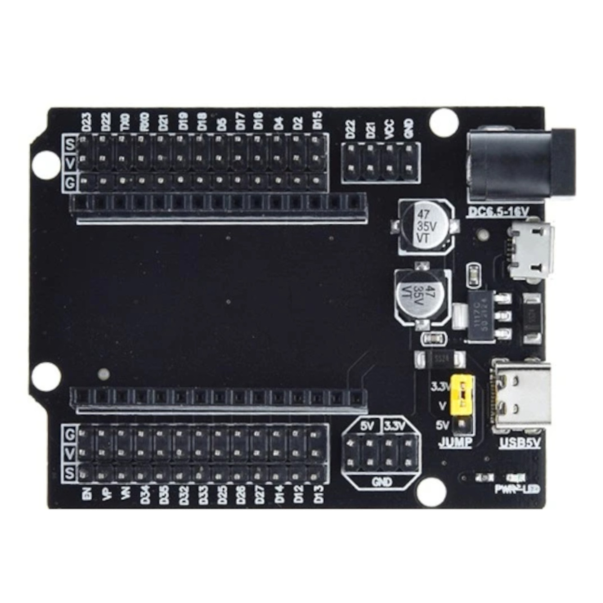
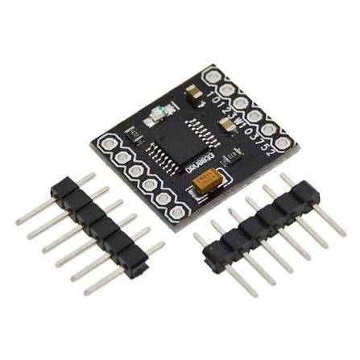
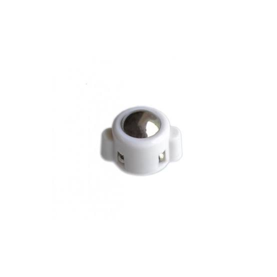

# Hardware

Toots is built around an ESP32, driving two N20 motors through a DRV8833, sensing walls with three VL53L0X ToF sensors, and tracking movement with magnetic wheel encoders.

## Components

| Photo | Component | Part | Role | Docs |
|---|---|---|---|---|
|  | MCU | ESP32 Dev Kit (30-pin) | Runs firmware + web dashboard | [→](components/esp32/README.md) |
|  | Expansion Board | ESP32 30-pin Shield | Breaks out GPIO for wiring | [→](components/esp32-shield/README.md) |
|  | Motor Driver | DRV8833 (2-channel) | Drives both N20 motors | [→](components/motor-driver/README.md) |
|  | Motors | N20 DC w/ Encoder, 6V 530 RPM | Differential drive + speed feedback | [→](components/encoder/README.md) |
|  | ToF Sensors ×3 | VL53L0X | Wall detection: front, left, right | [→](components/tof-sensor/README.md) |
|  | IMU | MPU-6050 | On board, not yet used in firmware | [→](components/imu/README.md) |
|  | Caster Wheel | Small Ball Caster | Third point of contact | [→](components/caster-wheel/README.md) |
|  | Standoffs | M3 Nylon Hex Spacer | Chassis layer mounting | [→](components/hex-spacer/README.md) |
|  | Battery | 18650 Li-ion | Main power | [→](components/battery/README.md) |
|  | Wiring | Jumper Wires | Sensor & module connections | [→](components/jumpers/README.md) |

## Pin Map

| Function | GPIO |
|---|---|
| Left motor IN1 / IN2 | 14 / 12 |
| Right motor IN3 / IN4 | 13 / 15 |
| Left encoder C1 / C2 | 34 / 35 |
| Right encoder C1 / C2 | 32 / 33 |
| ToF I2C SDA / SCL | 21 / 22 |
| ToF Front / Left / Right XSHUT | 25 / 26 / 27 |

Click into any component above for wiring details, how it's used in the code, specs, and troubleshooting.

## 3D Models

The chassis STL and Fusion 360 source link are in [`3d-models/`](3d-models/README.md).
