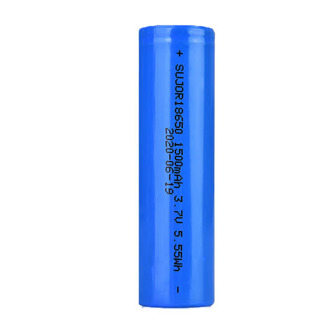
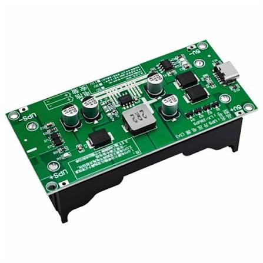

# Power: 18650 Li-ion Battery + Charger

## What is this?

Main power source for the robot, plus the module used to recharge it.

## Specs

- **Battery:** Li-ion 18650 cell
- **Charger:** Type-C, 15W, 3A charging module

## Notes

- Powers the motors (via the DRV8833) and the ESP32 separately from USB — check your regulator/voltage setup if running the ESP32 directly off this cell, since it needs a stable 3.3–5V.
