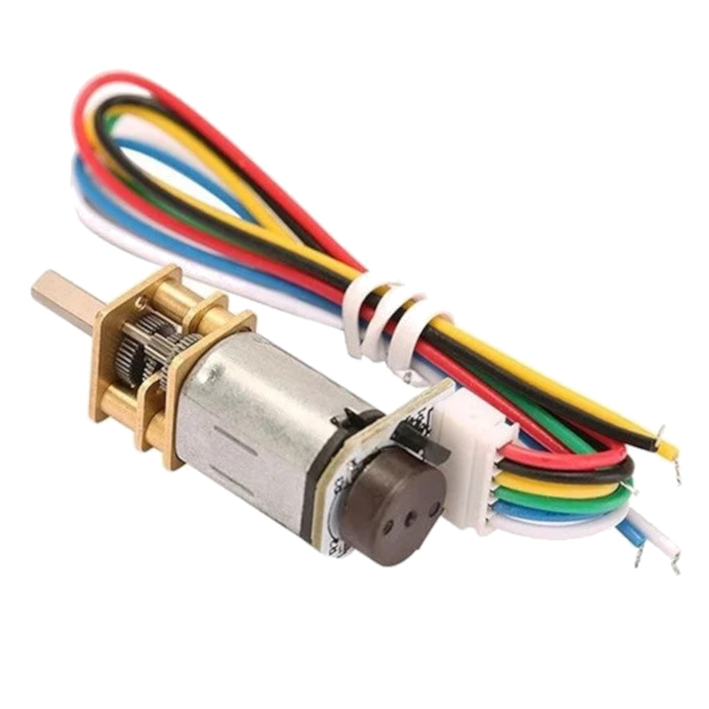

# N20 Magnetic Encoder



## What is this?

Reads wheel rotation from the N20 motors' built-in magnetic encoders using hardware interrupts. Used for distance tracking (how far each wheel has turned) and forward-motion PID correction.

## Hardware Connections

| Pin | Connects to | Role |
|---|---|---|
| C1 (Left) | ESP32 GPIO 34 | Main counting pin (interrupt on RISING) |
| C2 (Left) | ESP32 GPIO 35 | Direction detection |
| C1 (Right) | ESP32 GPIO 32 | Main counting pin (interrupt on RISING) |
| C2 (Right) | ESP32 GPIO 33 | Direction detection |
| VCC | 3.3V | Power |
| GND | Ground | Ground |

## How It Works

Interrupt-based counting — no polling:

```cpp
void IRAM_ATTR leftEncoderISR() {
  if (digitalRead(ENC_LEFT_C2) == HIGH)
    leftTicks++;
  else
    leftTicks--;
}
```

- Every rising edge on C1 fires the interrupt
- C2's state at that moment tells us the rotation direction (increments or decrements `leftTicks`/`rightTicks`)
- `resetEncoders()` zeroes both counters (used at the start of every move)

Ticks are read safely mid-motion by briefly disabling interrupts:

```cpp
noInterrupts();
dL = leftTicks;
dR = rightTicks;
interrupts();
```

## Specifications

- **Encoder resolution:** 530 PPR (pulses per revolution)
- **Motor:** N20 DC, 6V, 530 RPM

## Used In

- `moveContinuousForward()` — encoder difference (`dL + dR`) feeds the PID loop to keep both wheels in sync
- `CELL_TICKS` (currently `250`) — how many ticks equal one maze cell of forward travel

