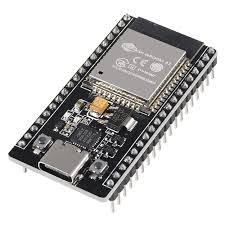

# ESP32 Dev Kit (30-pin)

## What is this?

The brain of Toots — a dual-core microcontroller with built-in WiFi. It runs the maze-solving logic, drives the motors, reads all sensors, and hosts a live web dashboard for monitoring and tuning.

## Role in the System

- Runs the main control loop (`solverStep()`) — sensing, PID correction, floodfill decisions
- Hosts a `WebServer` on port 80 serving a live dashboard (position, sensor readings, tunable parameters)
- Connects to WiFi via **WiFiManager** — no hardcoded credentials. On first boot (or after a reset) it opens its own setup access point (`TOOTs-Setup`); connecting to that AP lets you pick your home WiFi and enter the password once, which is then saved to flash
- Reachable at `http://toots.local` via mDNS, or by IP shown in Serial output

## Hardware Connections

All sensor and motor pins connect here — see each component's own page (`encoder/`, `motor-driver/`, `tof-sensor/`) for exact pin numbers.

## Used In

- `setup()` — initializes motors, encoders, ToF sensors, WiFi, and the web server
- `loop()` — handles incoming web requests and runs the active solve/return/speedrun mode every 20ms

## Troubleshooting

**Can't reach the setup portal:**
- Look for a WiFi network called `TOOTs-Setup` and connect to it, or manually browse to `192.168.4.1`
- If it's forgotten your WiFi, uncomment `wm.resetSettings();` in `setup()` once to force the portal again, then re-comment it

**Can't reach `toots.local`:**
- Not all networks/devices support mDNS — check the Serial monitor for the IP address instead and use that directly
