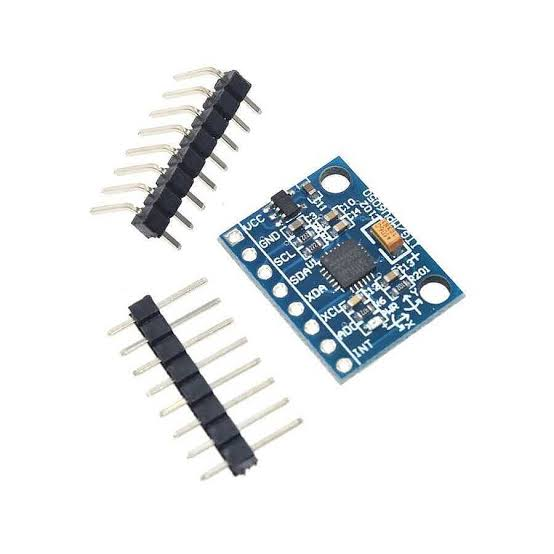

# MPU-6050 (Gyroscope + Accelerometer)

## What is this?

A 6-DoF IMU (gyroscope + accelerometer), included in the build for heading tracking.

This sensor is part of the hardware but **isn't wired into `toots.ino`'s logic yet** — the current heading/turn control relies entirely on the ToF wall-following (`getWallCorrection()`) and calibrated turn delays (`TURN_DELAY_LEFT`, `TURN_DELAY_RIGHT`, `TURN_DELAY_180`), not gyroscope data.

It's documented here for completeness and as a planned upgrade — adding gyro-based heading correction would reduce drift during turns compared to fixed time delays.

## Hardware Connections

| Pin | Connects to |
|---|---|
| SDA | ESP32 GPIO 21 (shared I2C bus with ToF sensors) |
| SCL | ESP32 GPIO 22 (shared I2C bus with ToF sensors) |
| VCC | 3.3V |
| GND | Ground |
