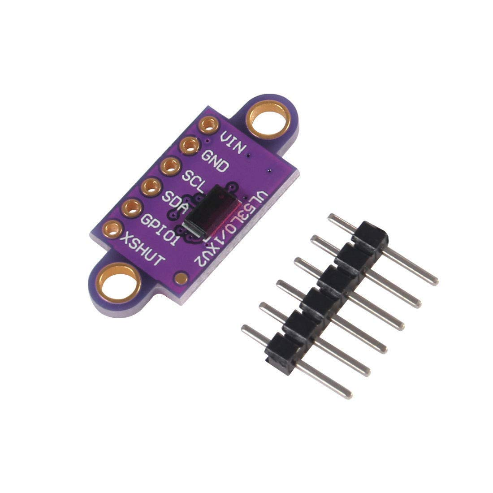

# VL53L0X Time-of-Flight Sensors (×3)



## What is this?

Three laser-based distance sensors (front, left, right) that detect maze walls. They share one I2C bus, so each is given a unique address at boot.

## Hardware Connections

| Pin | Connects to | Role |
|---|---|---|
| SDA (all 3) | ESP32 GPIO 21 | Shared I2C data line |
| SCL (all 3) | ESP32 GPIO 22 | Shared I2C clock line |
| XSHUT (Front) | ESP32 GPIO 25 | Power-down control, used to assign address |
| XSHUT (Left) | ESP32 GPIO 26 | Power-down control, used to assign address |
| XSHUT (Right) | ESP32 GPIO 27 | Power-down control, used to assign address |

## How It Works

**Startup — assigning unique addresses:**

All VL53L0X sensors boot with the same default I2C address, so they can't just be wired in parallel and read directly. `setupToFs()` gets around this:

1. Pull all three XSHUT pins LOW (all sensors off)
2. Bring one sensor's XSHUT HIGH, initialize it, and reassign its I2C address (front → `0x30`, left → `0x31`, right → `0x32`)
3. Repeat for the next sensor

**Reading:**

```cpp
void readToFs() {
  int f = tofFront.readRangeContinuousMillimeters();
  ...
  if (tofFront.timeoutOccurred() || f <= 0 || f > 2000) {
    f = 2000;  // treat invalid reading as "no wall in range"
  }
  ...
}
```

`readToFsAveraged()` takes 3 readings 20ms apart and averages them for more stable values, used before turns.

## Used In

- `leftWall()`, `frontWall()`, `rightWall()` — compare distance against `WALL_THRESHOLD` (`200`mm)
- `getWallCorrection()` — steers the robot to stay centered between walls (or a fixed distance from a single wall) while driving forward
- Floodfill mapping — wall presence per cell is recorded from these readings

## Specifications

- **Front stop distance:** `FRONT_STOP` = 100mm 
- **Wall detection threshold:** `WALL_THRESHOLD` = 200mm
- **Side wall target distance:** `SIDE_TARGET_MM` = 45mm

